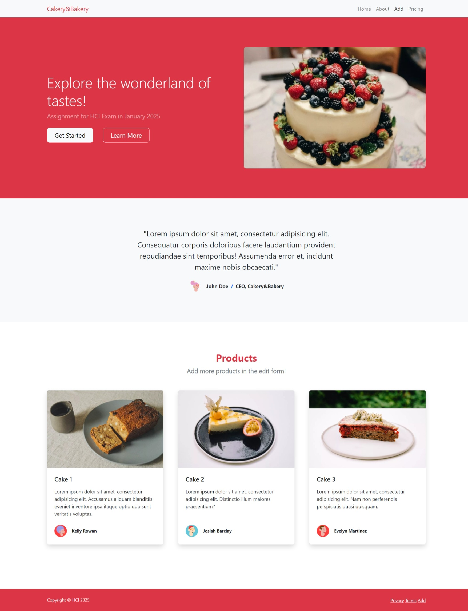
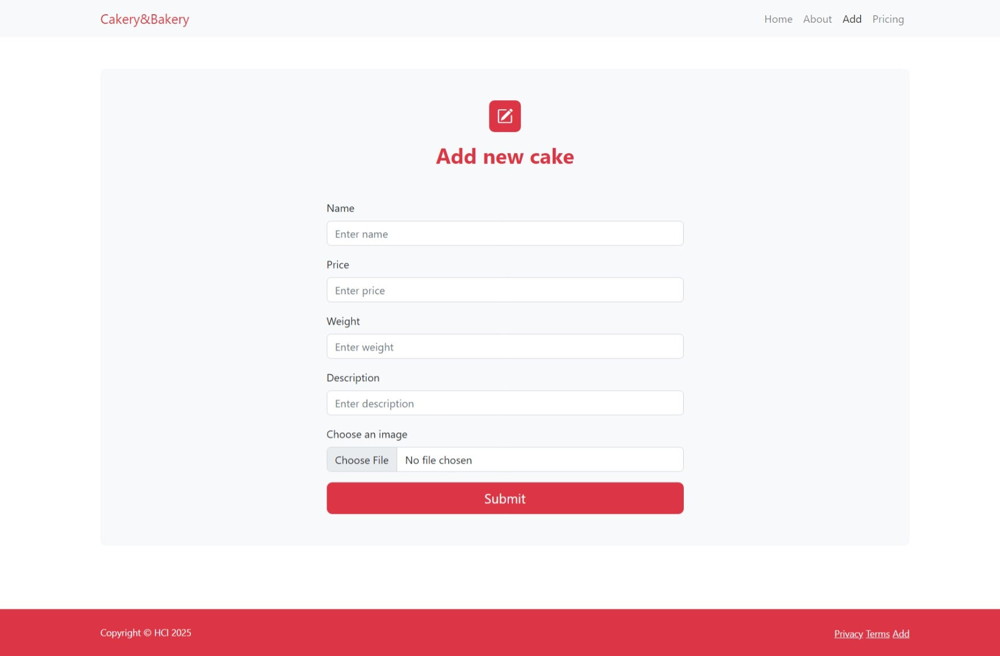

### Cakery&Bakery

Имате задача да креирате систем за управување со продавница за торти. Системот на првата страна треба да ги листа сите
достапни торти (види index.html). Секоја торта има име, цена, тежина, опис и слика.

Системот има и корисници (пекари) кои можат да додаваат нови торти. Секој од овие корисници има име, презиме, телефон за
контакт и email адреса. Точно се знае кој пекар ја има додадено која торта. Само пекарот што ја има додадено тортата
може да прави промени на истата.

За да може подобро да ја демонстрирате апликацијата, треба да имате додадено барем два пекари и тортите кои се
дефинирани на страната index.

Исто така, потребно е и одредено прилагодување во административниот панел на Django. Притоа, во рамки на админ панелот
потребно е да ги обезбедите следните функционалности:

* Пекарите можат да бидат додадени, менувани и бришени само од супер-корисници.
* Еден пекар може да има максимум 10 торти во дадено време.
* Кога се брише пекарот, неговите торти по случаен избор се додаваат на останатите пекари.
* Вкупната цена на тортите на еден пекар не смее да надминува 10 000.
* Тортите можат да бидат менувани само од пекарите кои ги додале, а останатите пекари може само да ги гледаат тие торти.
* Пекар не може да додаде торта, ако веќе постои торта со истото име.
* На супер-корисниците во Админ панелот им се прикажуваат пекарите со помалку од 5 торти.

Web апликацијата се состои од една почетна страна, прикажана на сликата подолу која ги прикажува сите достапни торти и
страна за додавање на нова торта.

index.html

add.html
